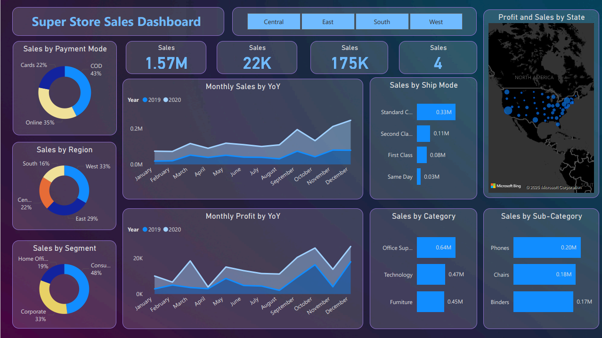
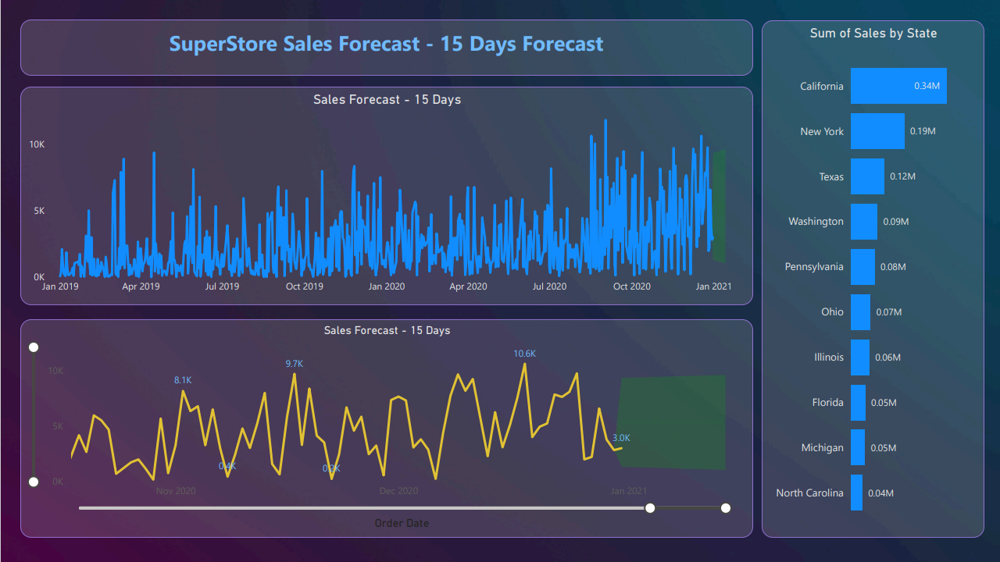

# 📊 SuperStore Sales Dashboard - Power BI Project

## 🧠 Objective

To contribute to business success by applying data analysis techniques—particularly **time series analysis**—to deliver valuable insights and accurate sales forecasting. The project focuses on helping business stakeholders understand past trends, present conditions, and make informed decisions for the future.

---

## ✅ Key Components

### 1. 📈 Dashboard Creation
- Identified key KPIs and business metrics.
- Designed an intuitive and interactive dashboard using **Power BI**.
- Incorporated dynamic filters and visuals to explore data by region, segment, category, and more.

### 2. 📊 Data Analysis
- Analyzed sales trends across time, region, category, and customer segments.
- Visualizations provide a snapshot of top-performing categories, shipping modes, and regional performance.

### 3. ⏳ Sales Forecasting
- Used **time series analysis** on historical sales data.
- Generated a **15-day forecast** to predict upcoming sales trends.

### 4. 📌 Actionable Insights
- Provided business stakeholders with digestible insights and visual recommendations.
- Enabled decision-making around product strategy, logistics, and marketing focus.

---

## 🔍 Features

- 📌 **Filters**: Region-based filtering (Central, East, South, West).
- 💳 **Payment Modes**: Distribution across Cards, Online, and COD.
- 🚚 **Shipping Analysis**: Insights on delivery methods and their sales impact.
- 🌎 **Geographic Analysis**: Sales and profit mapping by U.S. states.
- 🧾 **Segment & Category Breakdowns**: Detailed look into customer segments and product lines.
- 📅 **Year-on-Year Comparisons**: Monthly sales and profit trends for 2019 vs. 2020.
- 📉 **Forecasting Visuals**: 15-day prediction using time-series plots.

---

## 🧰 Tools & Techniques Used

- **Power BI** – For data visualization and dashboard creation  
- **DAX** – For calculated columns and measures  
- **Time Series Analysis** – For forecasting future sales  
- **Data Cleaning & Modeling** – Structured data for business intelligence purposes

---

## 🔮 Sales Forecast Screenshot

---

## 💬 Conclusion

This project showcases how data can be transformed into actionable insights using visualization tools and forecasting techniques. It offers a strong example of how **Power BI** can empower business users to explore their data with clarity and make informed strategic decisions.

